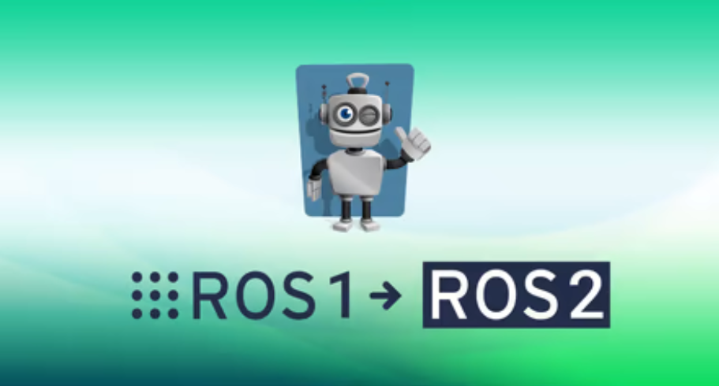

# RT2 Assignment 1 - branch *ros2*

*Francesco Ganci* - 4143910 - 2021/2022

> Compatible With:
> - ROS1 noetic
> - ROS2 Foxy



## What is this?

This repository contains two variations based on the project [CarmineD8/rt2_assignment1 on GitHub](https://github.com/CarmineD8/rt2_assignment1):

- branch *action* : the rospy node `go_to_point.py` is implemented as a ROS1 action service, enabling the node to interrupt the random behaviour. 

- branch *ros2* : the ROS/C++ nodes `position_service.cpp` and `state_machine.cpp` are reimplemented as ROS2 nodes, and a ROS1 brige is used to enable the C++ nodes to communicate with the other part of the project running on the ROS1 side.

This readme documents the branch *ros2* inside this repository. 

### Structure of the repository - branch *ros2*

Here is the structure of the repository as just downloaded from GitHub, without compiling it. 

```
/rt2_assignment_1
├── shell	<> everthing you need to build and run the project
│
├── ws_bridge	<> ROS1 workspace for the ROS1 bridge
│   └── build_bridge_base.sh	<> download and compile the bridge
│
├── ws_ros1
│   ├── build.sh	<> build the ROS1 side
│   └── src
│       ├── ros1_bridge_support_pkg	<> simple_bridge ROS1 side
│       │   └── src
│       │       └── ros1_bridge_support_node.cpp	<> the ROS1 endpoint for simple_bridge
│       │
│       └── rt2_assignment1	<> nodes ROS1 side
│           ├── launch
│           │   ├── sim.launch	<> launch the project on the ROS1 side only without the bridge
│           │   └── sim_bridge.launch	<> launch the ROS1 side only
│           ├── scripts
│           │   ├── go_to_point.py
│           │   └── user_interface.py
│           ├── src
│           │   ├── position_service.cpp
│           │   └── state_machine.cpp
│           ├── srv
│           │   ├── Command.srv
│           │   ├── Position.srv
│           │   └── RandomPosition.srv
│           └── urdf
│               └── my_robot.urdf	<> robot description for Gazebo
│
└── ws_ros2
    ├── build.sh	<> build the ROS2 side
    └── src
        ├── ros2_bridge_support_pkg	<> simple_bridge ROS2 side
        │   └── src
        │       └── ros2_bridge_support_node.cpp	<> the ROS2 endpoint for simple_bridge
        │
        └── rt2_assignment_1	<> ROS2 side as C++ package
            ├── src
            │   ├── position_service.cpp
            │   └── state_machine.cpp
            └── srv
                ├── Command.srv
                ├── Position.srv
                └── RandomPosition.srv
```

# How to setup and run the project - branch *ros2*

Here are some instructions for installing and running the code inside the project. 

## Prerequisites and Dependencies

Before installing the project, make sure your system satisfies these requirements:

- a linux-based installation with both ROS1 and ROS2 (the project is compatible with **ROS1 Noetic** and **ROS2 Foxy**).
	
	I strongly suggest to use this Docker image: [carms84/noetic_ros2](https://hub.docker.com/r/carms84/noetic_ros2) unless you have particular needs. 

- before going further, *unsource every distros*: each script inside the project can deal with the sources automatically. 

- it deserves a note the fact that the scripts inside the project, for simplicity reasons, work with *absolute paths*. 
	
	I think it's better to use the scripts alongside with the project to make it work instead of working by hand with the console, but of course if you want to work with the project in another path, it's not so much difficult to update the main scripts. 

Below are the dependencies of the project; with the scripts, you don't need to download them because they are already integrated in the project and ready to compile and use. 

### DEPT -- URDF robot description

The simulation uses Gazebo and the URDF model here: [robot_description on GitHub](https://github.com/CarmineD8/robot_description). Downloading the model is not necessary to run the project: the model is already integrated with this package. 

Inside the project there's a launch file which launches only the simulation without the other nodes:

```bash
roslaunch rt2_assignment1 launch_gazebo.launch
```

### DEPT -- ROS1 Bridge

The communication between the two middlewares ROS1 and ROS2 is managed by the so called *ROS1 Bridge*, which simply transmits one message from one side to the other one. 

Here you can find the official repository: [ROS1 Bridge on GitHub](https://github.com/ros2/ros1_bridge)

You don't need to manually install it if you use the scripts inside the project here; in any case, try to follow the structure of the project. 

### DEPT -- simple_bridge

The ROS1 Bridge works quite well, but it is very limited, and compile it is a endless boredom. For this reason (but also for practising with a more complex C++ code, mabe the main reason for this *suffering*), I implemented an overlay of the bridge written in C++. 

Here you can find the code, which is already integrated wth the actual version of the project: [programmatoroSeduto/simple_bridge on GitHub](https://github.com/programmatoroSeduto/simple_bridge#ros1-bridge-support----a-c-overlay-for-ros-bridge). 

This overlay works following a simple principle: each message is serialized into a string (see the standard message `std_msgs/msg/String`) and transmitted from one side to another, and then re-built on the other side. This simple idea is used for implement both topic protocol and service protocol: please refer to the documentation for this code. Notice that the code works, but sometimes it returns wrong outputs to the console, so don't worry about it: it works (as far as I know after some testing ... never enough, anyway).

Just note that the project already contains, in each workspace, a package named `rosXXX_bridge_support_pkg`, each of them containing one C++ node which implements an endpoint. So, again, you don't need to download this. 

### DEPT -- Colcon Build

The project uses the standard build system for ROS2, **Colcon**. If you haven't Colcon on your machine, run this script:

```bash
# if you're using Docker, a strange "error message" will appear, but you can ignore it. 
#    see troubleshooting to know more about it
sudo echo "deb [arch=amd64,arm64] http://repo.ros2.org/ubuntu/main `lsb_release -cs` main" > /etc/apt/sources.list.d/ros2-latest.list
# no print
curl -s https://raw.githubusercontent.com/ros/rosdistro/master/ros.asc | sudo apt-key add -
# print OK on the screen

sudo apt update -y
# sudo apt upgrade -y
sudo apt install python3-colcon-common-extensions -y

# test the installation
colcon colcon version-check
# also try this
colcon -h
```

Just to be sure that everything worked in the right way, the last command returns this output on my machine (obtained testing the installation on a clean installation of the Docker machine I suggest to use, see [carms84/noetic_ros2](https://hub.docker.com/r/carms84/noetic_ros2)):

```
$$ colcon version-check
colcon-argcomplete 0.3.3: up-to-date
colcon-bash 0.4.2: up-to-date
colcon-cd 0.1.1: up-to-date
colcon-cmake 0.2.26: up-to-date
colcon-core 0.8.1: up-to-date
colcon-defaults 0.2.6: up-to-date
colcon-devtools 0.2.3: up-to-date
colcon-installed-package-information 0.0.1: up-to-date
colcon-library-path 0.2.1: up-to-date
colcon-metadata 0.2.5: up-to-date
colcon-notification 0.2.13: up-to-date
colcon-output 0.2.12: up-to-date
colcon-override-check 0.0.1: up-to-date
colcon-package-information 0.3.3: up-to-date
colcon-package-selection 0.2.10: up-to-date
colcon-parallel-executor 0.2.4: up-to-date
colcon-pkg-config 0.1.0: up-to-date
colcon-powershell 0.3.7: up-to-date
colcon-python-setup-py 0.2.7: up-to-date
colcon-recursive-crawl 0.2.1: up-to-date
colcon-ros 0.3.23: up-to-date
colcon-test-result 0.3.8: up-to-date
colcon-zsh 0.4.0: up-to-date
```

For further informations about how to install Colcon (or in case of any unforeseen troubles), here's the installation instructions from the official documentation: [readTheDocs - colcon installation instructions](https://colcon.readthedocs.io/en/released/user/installation.html). Also take a look at the section **troubleshooting** later in this README: maybe luck smiles on you.

## Installation

I recommend to follow these steps below for installing the project:

1. go inside the system `/root` folder

2. clone the repository here with the shell command:
	
	```bash
	git clone https://github.com/programmatoroSeduto/rt2_assignment_1.git -b ros2 rt2_assignment_1
	```
	
	after that, you should see a folder `/rt2_assignment_1` inside the folder `/root`.
	
3. go inside the `shell` folder in the project and compile everything.
	
	For compiling every workspace inside the project, run this script:
	
	```bash
	cd /root/rt2_assignment_1/shell
	chmod +x *
	./shell_build.sh
	```
	
	the script will open three new consoles, each one building one workspace inside the project: 
	
	- `ROS1 build` for *ros1_ws*, 
	- `ROS2 build` for *ros2_ws* 
	- and `BRIDGE build` for *bridge_ws*.
	
	The console named *BRIDGE build* requires much time that the others: on my machine (fortunately I've a very good PC right now) it takes 5 minutes to end. 
	
	In alternative to the usual build path, if you already have a compiled ROS1 Bridge somewhere, you can import it under the folder `bridge_ws` (remember that this is a ROS1 workspace) instead of re-compile it, and run this other script:
	
	```bash
	cd /root/rt2_assignment_1/shell
	chmod +x *
	./shell_build_ws_only.sh
	```
	
4. (optional) check the installation
	
	you can notice, when the build is over, that the installation script made a *log* folder inside the project root. They're nothing more than the redirected output from the compiler. Check them to understand if the installation succeeded. 
	
	In particular, inside the log file `ws_bridge_build.log`, you should see something similar to the following screen:
	
	```
	ROS_DISTRO was set to 'foxy' before. Please make sure that the environment does not mix paths from different distributions.
	Starting >>> ros1_bridge
	[Processing: ros1_bridge]
	... garbage ...
	[Processing: ros1_bridge]
	Finished <<< ros1_bridge [4min 53s]

	Summary: 1 package finished [4min 53s]
	ROS_DISTRO was set to 'noetic' before. Please make sure that the environment does not mix paths from different distributions.
	Supported ROS 2 <=> ROS 1 message type conversion pairs:
	  - 'actionlib_msgs/msg/GoalID' (ROS 2) <=> 'actionlib_msgs/GoalID' (ROS 1)
	  - 'actionlib_msgs/msg/GoalStatus' (ROS 2) <=> 'actionlib_msgs/GoalStatus' (ROS 1)
	  - 'actionlib_msgs/msg/GoalStatusArray' (ROS 2) <=> 'actionlib_msgs/GoalStatusArray' (ROS 1)
	... garbage ...
	```
	
	You can easily test the ROS1 side simply running the project via the launch file. Use this:
	
	```bash
	source /root/rt2_assignment_1/ws_ros1/devel/setup.bash
	roslaunch rt2_assignment1 sim.launch
	```
	
	Testing the ros2 side is ... a little bit more difficult. It's easier to run the project and test it. In any case, don't forget to look at the log file, which should resemble this:
	
	```
	Starting >>> rt2_assignment_1
	Finished <<< rt2_assignment_1 [9.46s]

	Summary: 1 package finished [9.64s]
	Starting >>> ros2_bridge_support_pkg
	Finished <<< ros2_bridge_support_pkg [8.09s]

	Summary: 1 package finished [8.35s]
	  1 package had stderr output: ros2_bridge_support_pkg
	```

### Map of the Scripts in the project

The project contains many little scripts that can help you in managing the code (I pull my own ears, I should have written them in a more standard way such as *makefile* or something like that ... maybe in future). Here's a quick map of the available scripts inside (bold text for the most useful scripts):

- `shell/`
	
	- `test/`
		
		- **`win_bridge.sh` : run the ROS1 bridge**
		- **`win_ros1_gazebo.sh` : run Gazebo and the entire set of nodes on the ROS1 side**
		- **`win_ros2.sh` : run the nodes on the ROS2 side**
		- **`win_user_interface.sh` : run the user interface on the ROS1 side**
		- **`win_ros_master.sh` : start the ROS1 master (nothing more)**
		
	- **`shell_build.sh` : build everything, ROS1 bridge included**
	- **`shell_build_ws_only.sh` : build everything except the ROS1 bridge**
	- **`shell_clean.sh` : delete all the installation files, before recompiling**
	
- `bridge_ws/`
	
	- `build_bridge_base.sh` : download the bridge from GitHub, then compile it
	- `clean_bridge_ws.sh` : delete the compiled files of the ROS1 bridge
	
- `ros1_ws/`
	
	- `build.sh` : build the ROS1 side
	- `clean_ros1_ws.sh` : delete the compiled file from the ROS1 side
	
- `ros2_ws/`
	
	- `build.sh` : build the ROS2 side
	- `clean_ros1_ws.sh` : delete the compiled file from the ROS2 side
	

## Run the project

As always, the project can be executed in two ways: 

- the quick one (*strongly recommended*: just use the material inside the project)
- and the slow one (run node per node and test)

### First way - "quick" launch

Before starting, make sure that the project has been correctly compiled, and, especially, make sure that none of the middlewares are sourced. Check your `.bashrc` file. 

You can follow these steps:

1. go inside the folder `/root/rt2_assignment_1/shell/test`. It contains everything you need for running the whole project. 
	
	```bash
	cd /root/rt2_assignment_1/shell/test
	```
	
2. first of all, run the script `win_ros_master.sh`
	
	I suggest to launch then with console from the GUI, so it is easier to spawn a new console for each script. Otherwise, for example, if you're using `terminator` (the main shell available in the Docker image), you can run the script typing
	
	```bash
	terminator -e "./win_ros_master.sh" --title="ROS1 Master"
	```
	
	Please refer to your preferred shell. 
	**Running the scripts into different shells ensure that ROS1 and ROS2 run without conflicts.**

3. let's start the ros2 side before: use the script `win_ros2.sh`
	
	terminator command:
	
	```bash
	terminator -e "./win_ros2.sh" --title="ROS2 side"
	```
	
4. run the "low" bridge (i.e. the ROS1 Bridge; the overlay runs inside the shells for ROS1 and ROS2) with the script `win_bridge.sh`.
	
	terminator command:
	
	```bash
	terminator -e "./win_bridge.sh" --title="BRIDGE"
	```
	
5. finally, run Gazebo with the ROS1 side, using `win_ros1_gazebo.sh`
	
	terminator command:
	
	```bash
	terminator -e "./win_ros1_gazebo.sh" --title="Gazebo/ROS1"
	
	# better to use this (suppress useless errors)
	terminator -e "./win_ros1_gazebo.sh 2> /dev/null" --title="Gazebo/ROS1"
	```
	
6. The last step is to launch the user interface. Launch the script `win_user_interface.sh`.
	
	terminator command:
	
	```bash
	terminator -e "./win_user_interface.sh" --title="RT2 Assignment 1 -- User Interface"
	```
	
	It will take a bit. After some seconds, a message like this will be propted: `Press 1 ro start the robot`, sign that the system s ready to go. 
	
	Notice that, since the node `go_to_point.py` is implemented here as a ROS1 service, the user interface must wait that the robot arrives at the objective; in fact, after `0`, the console will prompt a message like this before asking agan for `1`: `Please wait, the robot is going to stop when the position will be reached`.
	
Now the project is completely ready to use (I hope). Have fun!

### Second way - (very) slow launch - a deeper look into the architecture of the project

*If you really like the pain like me* here's how to run the project node by node. This method gives you a chance to explore more in detail the architecture of this project, very similar to the one seen in the branch *action* but with the difference that now two middlewares are involved. 

As always, before starting please *make sure that the project has been correctly compiled*, and, especially, that none of the middlewares are been sourced. I invite you to check your config file `.bashrc`. 

Here are the steps to follow:

1. **Shell 1** Run the ROS1 Master in background. To avoid possible troubles in launching the other node, it is always convenient to launch the ROS1 Master always before going on. 
	
	Remember to *source ROS1* here. 
	
	```bash
	# shell 1
	
	source /opt/ros/noetic/setup.bash && source /root/rt2_assignment_1/ws_ros1/devel/setup.bash
	roscore &
	```
	
2. **Shell 2.** Source ROS2 here. 
	
	```bash
	# shell 2
	
	source /opt/ros/foxy/setup.sh && source /root/rt2_assignment_1/ws_ros2/install/setup.sh
	```
	
	Now we can start running the architecture. 

3. *Shell 2.* Run the ROS2 node`position_service.cpp`.
	
	This node implements a simple service which generates randomly a position + orientation to reach, each time it is called.
	
	```bash
	# shell 2
	
	ros2 run rt2_assignment_1 position_service & 
	```
	
	there's no output from this node. So, check if the service is running with `ros2 service list`: you should see the service `/position_server`. Here are some checks you can do:
	
	```
	$$ ros2 service list
	/position_server
	... other stuff ...
	```

4. *Shell 2.* Run the ROS2 node `state_machine.cpp`.
	
	As for the branch *action*, this node is the central part of the architecture: the main working cycle is executed from here. Interesting to note that now the node `go_to_point` runs on the other side. 
	
	```bash
	# shell 2
	
	ros2 run rt2_assignment_1 state_machine & 
	```
	
	Again, no output comes from the node when spawned. You can check if it is running correctly through other ros2 commands. For instance, try the followings:
	
	```
	$$ ros2 node list
	/random_position_server
	/state_machine
	
	$$ ros2 service list
	/go_to_point
	...
	/user_interface
	```
	
	Interesting noticing that ros2 shows `go_to_point`, which is a client and not a service. 
	
5. *Shell 2.* The last thing you shoud run in ROS2 is the `ros2_bridge_support_node` which implements the overlay on the ROS2 side. Here's how to launch it:
	
	```bash
	# shell 2
	
	ros2 run ros2_bridge_support_pkg ros2_bridge_support_node &
	```
	
	The code should generate this output on the console (a little bit refined, because the real output you can see on the screen at this point from the ROS2 sde ... is technically wrong right now; I changed a bit the output here in order to avoid confusion, but the "feeling" of the output is the same):
	
	```
	[INFO] [1650725212.212647100] [ros2_bridge_support_node]: --- (in) SERVICE client in ROS1 service in ROS2: /user_interface
	[INFO] [1650725212.212722600] [ros2_bridge_support_node]: subscription to /bridge_service/user_interface_request
	[INFO] [1650725212.213078600] [ros2_bridge_support_node]: publisher on /bridge_service/user_interface_response
	[INFO] [1650725212.213341900] [ros2_bridge_support_node]: creating 'in' service /user_interface
	[INFO] [1650725212.213878400] [ros2_bridge_support_node]: --- (out) SERVICE client in ROS2 service in ROS1: /go_to_point
	[INFO] [1650725212.213915800] [ros2_bridge_support_node]: subscription to /bridge_service/go_to_point_response
	[INFO] [1650725212.214149400] [ros2_bridge_support_node]: publisher on /bridge_service/go_to_point_request
	[INFO] [1650725212.214393500] [ros2_bridge_support_node]: creating 'out' service /go_to_point
	[INFO] [1650725212.214945600] [ros2_bridge_support_node]: online!
	```
	
	After done that, these topics should appear:
	
	```
	$$ ros2 topic list
	/bridge_service/go_to_point_request
	/bridge_service/go_to_point_response
	/bridge_service/user_interface_request
	/bridge_service/user_interface_response
	```
	
	Let's explain a bit. The service `/user_interface` (the one allowing the external nodes to enable or disabe the working cycle), running on the ROS2 side, is split in two topics by the bridge support package:
	
	- subscription to `/bridge_service/user_interface_request` : the request comes from ROS1 and is processed by a node into ROS2
	- publisher on `/bridge_service/go_to_point_response` : the service response is sent from the ROS2 service node to the client in ROS1 which has made the request
	
	The contrary happens for the second mapped channel `/go_to_point` whose the service runs in ROS1. For this,
	
	- publisher on `/bridge_service/go_to_point_request` (for sending the request on the other side)
	- subscription to `/bridge_service/go_to_point_response` (for listening the response from the other side)
	
	Each of the topic here passes through the "low" bridge. 
	
6. **Shell 3.** Source both the middlewares (a warning will be print on the console; however you can ignore it) and run the "low-level" bridge:
	
	```bash
	# shell 3
	
	source /opt/ros/noetic/setup.bash & source /opt/ros/foxy/setup.bash
	source /root/rt2_assignment_1/ws_bridge/install/setup.sh
	ros2 run ros1_bridge dynamic_bridge --bridge-all-topics
	```
	
	Here's the warning to ignore, just for information:
	
	```
	ROS_DISTRO was set to 'foxy' before. Please make sure that the environment does not mix paths from different distributions.
	ROS_DISTRO was set to 'noetic' before. Please make sure that the environment does not mix paths from different distributions.
	```

7. *Shell 1.* Now, let's run the other ROS1 nodes. First of all, run the node `go_to_point.py`:
	
	```bash
	# shell 1
	
	rosrun rt2_assignment1 go_to_point.py &
	```
	
	No output is provided from here. 
	
8. *Shell 1.* run the bridge support, `ros1_bridge_support_node`:
	
	```bash
	# shell 1
	
	rosrun ros1_bridge_support_pkg ros1_bridge_support_node &
	```
	
	The output should be similar to this one:
	
	```
	[ros1_bridge_support_node] online!
	[ INFO] [1650726781.052126600]: [ros1_bridge_support_node] --- (out) SERVICE client in ROS1 service in ROS2: /user_interface
	[ INFO] [1650726781.052783700]: [ros1_bridge_support_node] publisher on /bridge_service/user_interface_request
	[ INFO] [1650726781.053151500]: [ros1_bridge_support_node] subscription to /bridge_service/user_interface_response
	[ INFO] [1650726781.054613400]: [ros1_bridge_support_node] creating 'out' service /user_interface
	[ INFO] [1650726781.055034800]: [ros1_bridge_support_node] --- (in) SERVICE client in ROS2 service in ROS1: /go_to_point
	[ INFO] [1650726781.055078800]: [ros1_bridge_support_node] subscription to /bridge_service/go_to_point_request
	[ INFO] [1650726781.056462500]: [ros1_bridge_support_node] publisher on /bridge_service/go_to_point_response
	[ INFO] [1650726781.056880200]: [ros1_bridge_support_node] creating 'in' service /go_to_point
	[ INFO] [1650726781.056974800]: [ros1_bridge_support_node] online!
	```
	
	This node works as its twin on the other side, but doing the contrary: subscribers become publishers, ando so on. 
	
9. *shell 1.* Finally you can run Gazebo. Use the launch file inside the project:
	
	```bash
	# shell 1
	
	# unfortunately Gazebo returns a lot of useless warnings; you can suppress them using
	roslaunch rt2_assignment1 launch_gazebo.launch 2> /dev/null
	
	# otherwise, if you want to see the warnings, use the common command
	roslaunch rt2_assignment1 launch_gazebo.launch
	```

10. **Shell 4.** The last step is running the *user interface*, as before.
	
	```bash
	# shell 4
	
	source /root/rt2_assignment_1/ws_ros1/devel/setup.bash
	rosrun rt2_assignment1 user_interface.py
	```

That's all: now the architecture is ready to use. 

# Troubleshooting

Here are some well-known problems, listed here for your convenience. 
Lamentably this list is far from exaustive. 

## Installation

### Colcon - *setrlimit(RLIMIT_CORE): Operation not permitted*

During the execution of the following script:

```bash
sudo echo "deb [arch=amd64,arm64] http://repo.ros2.org/ubuntu/main `lsb_release -cs` main" > /etc/apt/sources.list.d/ros2-latest.list
curl -s https://raw.githubusercontent.com/ros/rosdistro/master/ros.asc | sudo apt-key add -

sudo apt update
sudo apt install python3-colcon-common-extensions
```

It could appear this "intimidating" message on the screen: `sudo: setrlimit(RLIMIT_CORE): Operation not permitted`. It occurs especially when you attempt to run this code inside a Docker container.

*Who cares*. You can ignore this message, and keep going on, since the commands are effective anyway. See these posts:

- [in container: sudo: setrlimit(RLIMIT_CORE): Operation not permitted on GitHub Issues](https://github.com/sudo-project/sudo/issues/42)
- [sudo: setrlimit(RLIMIT_CORE): Operation not permitted on StackExchange](https://unix.stackexchange.com/questions/578949/sudo-setrlimitrlimit-core-operation-not-permitted)

### Colcon - error 404 during apt-get

It can happen in two situations (as far as I know):

- you're trying to directly install the package without having updated the repositories
	
	To avoid this annoying error, please follow all the steps in theinstallation script here.

- Launching `sudo apt update` after having updated the repositories is very important, and not doing this will result in a 404 error. 

### Bridge build - *TypeError: object of type 'NoneType' has no len()*

Sometimes, when you try to compile the bridge, this unintelligible error message could be spawn on the *BRIDGE Build* console: 

```
Cloning into 'ros1_bridge'...
remote: Enumerating objects: 1430, done.
remote: Counting objects: 100% (391/391), done.
remote: Compressing objects: 100% (45/45), done.
remote: Total 1430 (delta 374), reused 346 (delta 346), pack-reused 1039
Receiving objects: 100% (1430/1430), 1.51 MiB | 8.33 MiB/s, done.
Resolving deltas: 100% (896/896), done.
[0.183s] ERROR:colcon.colcon_core.package_discovery:Exception in package discovery extension 'prefix_path': object of type 'NoneType' has no len()
Traceback (most recent call last):
  File "/usr/lib/python3/dist-packages/colcon_core/package_discovery/__init__.py", line 250, in _discover_packages
    descs = extension.discover(
  File "/usr/lib/python3/dist-packages/colcon_installed_package_information/package_discovery/prefix_path.py", line 30, in discover
    num_packages = len(packages)
TypeError: object of type 'NoneType' has no len()
```

However, the build process starts anyway, hence you can ignore it. 

# Authors and Contacts

A project by *Francesco Ganci*, S4143910, upon a code kindly provided by [CarmineD8](https://github.com/CarmineD8).

- **Email** : _s4143910@studenti.unige.it_

# See also

Here are some useful link and tricks. 

## Projects on GitHub

- The "starter kit" for this project: [CarmineD8/rt2_assignment1 on GitHub](https://github.com/CarmineD8/rt2_assignment1)
- the URDF description of the robot: [robot_description on GitHub](https://github.com/CarmineD8/robot_description)
- The official version of [ros2/ros1_bridge on GitHub](https://github.com/ros2/ros1_bridge)
- [programmatoroSeduto/simple_bridge on GitHub](https://github.com/programmatoroSeduto/simple_bridge)

## Bash and Linux

- [Linux bash command : tree](http://mama.indstate.edu/users/ice/tree/)

## Docker

- Here's the Docker image I used for developing and testing the project: [carms84/noetic_ros2](https://hub.docker.com/r/carms84/noetic_ros2)

## Other Docs

- [readTheDocs - colcon installation](https://colcon.readthedocs.io/en/released/user/installation.html)
