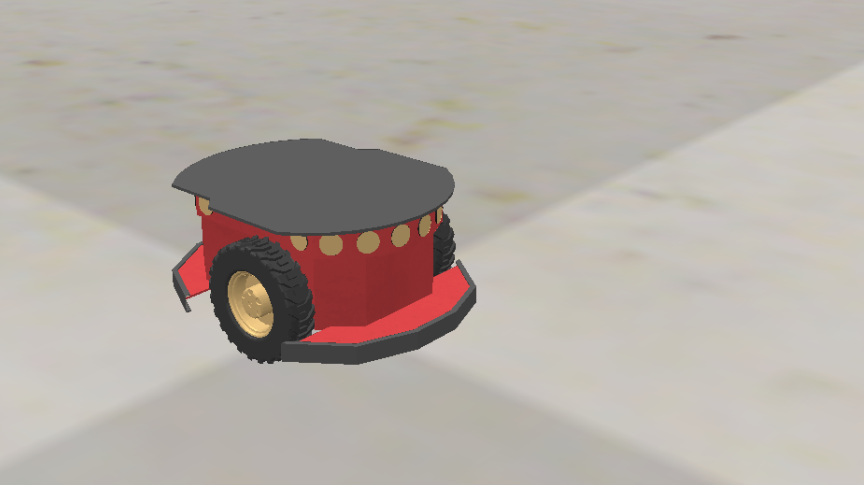

# RT2 Assignment 1 - branch *action*

*Francesco Ganci* - 4143910 - 2021/2022

> Compatible With:
> - ROS1 noetic



## What is this?

This repository contains two variations based on the project [CarmineD8/rt2_assignment1 on GitHub](https://github.com/CarmineD8/rt2_assignment1):

- branch *action* : the rospy node `go_to_point.py` is implemented as a ROS1 action service, enabling the node to interrupt the random behaviour. 

- branch *ros2* : the ROS/C++ nodes `position_service.cpp` and `state_machine.cpp` are reimplemented as ROS2 nodes, and a ROS1 brige is used to enable the C++ nodes to communicate with the other part of the project running on the ROS1 side.

Here the branch *action* is described. 

### Structure of the repository - branch *action*

This branch contains a package to put into a workspace and compile. Here is the file tree with the main files inside:

```
/rt2_assignment1
├── action	<> actions of the service
│   └── GoToPoint.action	<> used by go_to_point
│
├── docs	<> code documentation (branch action)
│   ├── Doxyfile	<> configuration file for Doxygen
│   ├── build	<> documentation with Doxygen
│   │   └── html
│   │       └── index.html	<> main page of the Doxygen documentation
│   │       
│   └── img
│
├── videos	<> some video samples of the project
│
├── launch	<> launch fles
│   ├── launch_gazebo.launch	<> only Gazebo
│   ├── sim.launch	<> Gazebo and the other nodes
│   └── sim_vrep.launch	<> arch only without Gazebo
│
├── models	<> robot model for the CoppeliaSim scene file
│   └── pioneer_rt2	<> the model of the simulated robot
│
├── scene	<> CoppeliSim files
│   └── pioneer_scene.ttt	<> scene file for CoppeliaSim
│
├── scripts	<> ROSpy nodes
│   ├── go_to_point.py	<> motion planning algorithm
│   └── user_interface.py	<> console interface
│
├── src	<> C++ nodes
│   ├── dummy_action_client.cpp	
│   ├── position_service.cpp	<> random position + orientation generator
│   └── state_machine.cpp	<> central node of the arch
│
├── srv			<> custom ROS1 services
│   ├── Command.srv	<> used by state_machine.cpp
│   ├── Position.srv	<> used by go_to_point.py
│   └── RandomPosition.srv	<> used by position_service.cpp
│
└── urdf
    └── my_robot.urdf	<> robot model for Gazebo
```

# How to setup and run the project - branch *action*

Here are the instruction for installing and running the project in your ROS1 environment. 

## Prerequisistes and dependencies

Before installing  the project, make sure to have a system with these requisites:

- a working installation of ROS1 (the project is compatible with **ROS1 Noetic**)
	
	better to use the Docker image [carms84/noetic_ros2](https://hub.docker.com/r/carms84/noetic_ros2) to run the project
	
- the branch *action* contains a package: create a workspace where to execute it before starting.
	
	Here's a script for quickly creating a workspace where to run the project. Notice that later a script for installing everything is provided, see the section *installation script* velow in this document. 
	
	```bash
	#! /bin/bash
	
	cd /root
	mkdir test_ws
	cd test_ws
	mkdir src
	catkin_make
	cd src
	```

No external dependencies are required to run the project. 

### DEPT -- URDF robot description

The simulation uses Gazebo and the URDF model here: [robot_description on GitHub](https://github.com/CarmineD8/robot_description). Downloading the model is not necessary to run the project: the model is already integrated with this package. 

Inside the project there's a launch file which launches only the simulation without the other nodes:

```bash
roslaunch rt2_assignment1 launch_gazebo.launch
```

## Installation

My advice is to use the script in the next section. However, you can follow these steps f you wan to download the project manually:

1. go inside the folder `src/` inside your workspace

2. download the project from GitHub (the folder of the package is called `rt2_assignment1`)
	```bash
	git clone https://github.com/programmatoroSeduto/rt2_assignment_1.git -b action ./rt2_assignment1
	```
	
3. compile the workspace with `catkin_make`. 

4. finally, source the workspace:
	```bash
	# from the root of the workspace
	source ./devel/setup.bash
	```

### Installation Script

Here's a quick setup for the project. It creates a broad new workspace inside the folder `/root` and attempts to compile and source it.

```bash
#! /bin/bash

set -e

# creation of the workspace
cd /root
mkdir test_ws
cd test_ws
mkdir src
catkin_make
cd src

# download and installation
git clone https://github.com/programmatoroSeduto/rt2_assignment_1.git -b action ./rt2_assignment1
cd ..
catkin_make
# source ./devel/setup.bash
```

## Run the project with Gazebo

There are two ways to run the project: a quick way (simple run), and a manual way (run and test). 

### First way - Quick Run

You can easily run the whole project using the launch file, even if I don't like much this method because the node `user_interface.py` cant give a clear output in the middle of the output from the other nodes. But if you're in a hurry, this just works:

```bash
roslaunch rt2_assignment1 sim.launch
```

After that, the window of Gazebo will appear with the robot spawned in the middle of the flat space. And, after a while, it will be prompted a message on the console (it take some seconds). When the system is ready, it keeps awaiting for an input from the user, showing a message like the following:

```
...garbage...
[ INFO] [1650875921.826729800, 0.164000000]: Loading gazebo_ros_control plugin
[ INFO] [1650875921.826899900, 0.164000000]: Starting gazebo_ros_control plugin in namespace: /robot
[ INFO] [1650875921.827424000, 0.164000000]: gazebo_ros_control plugin is waiting for model URDF in parameter [/robot_description] on the ROS param server.
[ INFO] [1650875921.949814600, 0.164000000]: Loaded gazebo_ros_control.
[urdf_spawner-4] process has finished cleanly
log file: /root/.ros/log/1b214d8c-c473-11ec-b29a-0242ac110002/urdf_spawner-4*.log

Press 1 to start the robot 
```

By sending `1` on the console, the robot will start to behave as described here, in a "endless" loop:

1. generate a random position inside the space
2. turn the robot towards the target
3. move the robot towards the (x, y) position
4. finally, align the head of the robot until the goal is reached

The goal can be cancelled in any time by sending `0` on the console. 

Here's an example of typical output from the program (a bit messy if you're using just the launch file): the robot is started giving the command to the console, then it moves and manages to achieve two goals before being stopped by the user command `0` (goal is cancelled). 

```
 ... 
[ INFO] [1650648569.087740600, 0.358000000]: Loaded gazebo_ros_control.
[urdf_spawner-4] process has finished cleanly
log file: /root/.ros/log/1b214d8c-c473-11ec-b29a-0242ac110002/urdf_spawner-4*.log

Press 1 to start the robot 1
[state_machine] START command received. 

Press 0 to stop the robot NEXT TARGET (3.40188, -1.05617, 1.77876)
[INFO] [1650648580.232422, 11.116000]: [go_to_point] goal: (3.401877, -1.056171, 1.778765)
[INFO] [1650648603.393141, 33.475000]: [go_to_point] SUCCESS in 802377915000000.000000 ms
Position reached
NEXT TARGET (2.9844, 4.11647, -1.90034)
[INFO] [1650648603.430313, 33.514000]: [go_to_point] goal: (2.984400, 4.116474, -1.900341)
[INFO] [1650648633.535185, 62.269000]: [go_to_point] SUCCESS in 1359315570000000.000000 ms
Position reached
NEXT TARGET (-1.64777, 2.6823, -1.39628)
[INFO] [1650648633.634829, 62.356000]: [go_to_point] goal: (-1.647772, 2.682296, -1.396283)
0
Please wait, the robot is going to stop when the position will be reached
[state_machine] STOP command received, preempting the goal. 

Press 1 to start the robot [INFO] [1650648638.520570, 67.087000]: CANCELLATION REQUEST RECEIVED.
The goal has been cancelled. 
Final goal not reached
```

### Second way - Slow running

I think this section can help for making clear the architecture of the project, which is made up of four nodes: 

- `go_to_point.py` : the motion planning algorithm
- `state_machine.cpp` : the working cycle of the robot
- `position_service.cpp` : random goal generator (a ROS1 service)
- `user_interface.py` : this node enables the user to turn on/off the working cycle

Follow these procedures:

1. run the Gazebo simulation using the launch file into the package:
	
	```bash
	roslaunch rt2_assignment1 launch_gazebo.launch
	```
	
	This launch file, besides to run the ROS1 master, also spawns the robot in the middle of the simulation space using the URDF model description from the package folder `.../rt2_assignment1/models`. 

2. run the node `go_to_point.py`:
	
	```bash
	rosrun rt2_assignment1 go_to_point.py
	```
	
	This node implements a quite simple motion planning algorithm which enables the robot to reach a position plus head orientation always with a straight line (actually it is not exact: the algorithm applies a little of curve to correct a possible disalignment due to disturbances in the odometry ad in the motion). 
	
	This functionality has been implemented as a ROS1 action server, hence it can be interrupted in any time using the cancellation. In the previous version, this node was a simple service, hence not interruptible until the end of the mission. 
	
3. time to launch the node the node `position_service.cpp`:
	
	```bash
	rosrun rt2_assignment1 position_service
	```
	
	This ROS1 quite simple service generates a position+orientation goal randomly within bounds attached to the service request. In this project, the only node using this service is `state_machine.cpp` which manages the working cycle of the robot. 
	
4. run the node `state_machine.cpp`:
	
	```bash
	rosrun rt2_assignment1 state_machine
	```
	
	This is the main part of the architecture here. The node cyclically requires a new random position using `position_service.cpp` and then makes the robot to reach the position thanks to `go_to_point.py`. 
	
	Besides to run the main working cycle, this node also implements a simple service enabling another node to turn on/off the loop.
	
5. finally, run the node `user_interface.py`:
	
	```bash
	rosrun rt2_assignment1 user_interface.py
	```
	
	My advice is to run this node inside a different console, to make easier the interaction. This node provides a roughly coarse console user interface: just a switch for the main loop. 
	
	In particular, there's no data visualisation, neither other ways to control the behaviour of the robot. For an example of improved user interface, see [rt2_assignment2 on GitHub](https://github.com/programmatoroSeduto/rt2_assignment_2) using Jupyter Notebooks, MatPlotLib and other frameworks for making user-friendly visuals. 

## Run the project with CoppeliaSim

Gazebo is a good simulation environment, nevertheless a bit limited. Hence, the branch *action* can work together with VRep/CoppeliaSim as well, a powerful and flexible simulation environment. 

Here are the instructions for setting up and running the project using VRep/CoppeliaSim. It is a roughly boring job, so, if you haven't particular needs, I think it's better to exploit the script in the section *Script for CoppeliaSim setup* later on this README file. 
Of course, if you encounter any issue with that script, consider to follow the installation step by step to catch the probem and fix it. 

### CoppeliaSim Setup

Inside the package there's all you need in order to simulate the robot inside the environment: you have just to install the application on your machine and run it. 

Follow these steps:

1. you need at least version 4.3.0 in order to run the scene in the package. [Download VRep/CoppeliaSim](https://www.coppeliarobotics.com/downloads) from the official site, **'edu' version**.
	
	I'm assuming you're installing the project on Linux-based environment. So, remember to download the `.tar.xz` format. 
	
	On my machine, using Firefox the download folder  will be at the path `/root/Downloads`. 
	
	Another way to get the installation file is to use `curl` as follows:
	
	```bash
	cd /root
	curl https://www.coppeliarobotics.com/files/CoppeliaSim_Edu_V4_3_0_Ubuntu20_04.tar.xz -o coppeliasim_edu.tar.gz
	```
	
	wait a while, and 

2. go inside your download folder and extract the content from the compressed file. For your convenience, here's the bash command:
	
	```bash
	# after the downloading with a browser from the official site
	tar -xf CoppeliaSim_Edu_V4_3_0_Ubuntu20_04.tar.xz
	
	# if you're using CURL as seen before, 
	tar -xf coppeliasim_edu.tar.gz
	```
	
	After a while, a folder should have been created in the same path of the archive. The folder should be labeled `CoppeliaSim_Edu_V4_3_0_Ubuntu20_04`. 

That's all: the simulation environment is now ready to use. If you want, I think it's better to move every installation files into the `/root` folder. 

### Script for CoppeliaSim setup

Here's a helpful script for downloading and installing CoppeliaSim in your `/root` folder. 

```bash
#! /bin/bash

set -e

# download CoppeliaSim from the official site using CURL
echo "downloading CoppeliaSim ... "
cd /root
curl https://www.coppeliarobotics.com/files/CoppeliaSim_Edu_V4_3_0_Ubuntu20_04.tar.xz -o coppeliasim_edu.tar.gz
echo "downloading CoppeliaSim ... OK"

# extract the archive
echo "unpacking files ... "
tar -xf coppeliasim_edu.tar.gz
# new folder: CoppeliaSim_Edu_V4_3_0_Ubuntu20_04
echo "unpacking files ... OK"

# final steps
echo "cleaning ... "
mv CoppeliaSim_Edu_V4_3_0_Ubuntu20_04/ coppeliasim
rm coppeliasim_edu.tar.gz
echo "cleaning ... OK"

cd /root/coppeliasim
chmod +x ./coppeliaSim.sh
cd /root

echo "done"
```

### Run the project with VRep/CoppeliaSim

First of all, you need to open CoppeliaSim and check if everythin is working. In case of troubles, see the next section **VRep/CoppeliaSim Troubleshooting** for further infos (maybe you're lucky and I catched your issue before on my own).

Here are the steps for running VRep/CoppeliaSim in the right way. I assume here that the script showed before has been employed in order to install the simulation environment. 

1. *remember to run the ROS master before going further*, and to source ROS1:
	```bash
	# source /opt/ros/noetic/setup.bash
	# source /root/test_ws/devel/setup.bash
	# source /root/test_ws/devel/setup.bash && roscore &
	
	roscore &
	```
	
2. now, launch the simulation. 
	
	Here's the quick way: the following command will start CoppeliaSim with the simulation already running. 
	
	```bash
	roscd rt2_assignment1
	cd ./scene
	/root/coppeliasim/coppeliaSim.sh -s -q pioneer_scene.ttt
	```
	
	Otherwise, you can run the scene loading it from VRep/CoppeliaSim. The package contains a simple implementation for a  (2, 0) mobile robot. 

3. (optional) check if everything is working as expected.
	
	First of all, you should see something similar to the following message on the console inside VRep/CoppeliaSim:
	
	```
	[sandboxScript:info] Simulator launched, welcome!
	[sandboxScript:info] Simulation started.
	ROS1 plugin correctly loaded. 
	wheel axis length: 0.33100044730294
	wheel radius: 0.097499988973141
	```
	
	Open another console, source ROS1, and check which topics are running with the command `rostopic list`. You should see at least the two topics `/cmd_vel` and `/odom`. 
	
	By the command `rosnode list` a node `/sim_ros_interface` should appear. 

4. now you can run the architecture. 
	
	The quick way: use the launch file inside the package. 
	
	```bash
	roslaunch rt2_assignment1 sim_vrep.launch
	```
	
	Otherwise, the best is to run the user interface in another console. First of all, launch the main nodes:
	
	```bash
	# SOURCE THE WORKSPACE!
	# roscore &
	rosrun rt2_assignment1 go_to_point.py &
	rosrun rt2_assignment1 position_service &
	rosrun rt2_assignment1 state_machine &
	```
	
	And finally open another console and run this inside:
	
	```bash
	rosrun rt2_assignment1 user_interface.py
	```

That's all. 

### VRep/CoppeliaSim Troubleshooting

Here are some well-known issues that could occur in trying to run VRep/CoppeliaSim along with ROS. 

**UNABLE TO LOAD THE ROS1 PLUGIN** (with ROS master not running)

*This error shouldn't occur if you run the simulation exactly as I described beforehand.*

Notification on the console: VRep/CoppeliaSim should complain with the following message. (Notice that you can ignore the error referring to the ROS2 plogin because it is of no use for this project) 

```
[CoppeliaSim:loadinfo]   plugin 'ROS': loading...
[simExtROS:error]   ROS master is not running
[CoppeliaSim:error]   plugin 'ROS': load failed (failed initialization).
[CoppeliaSim:loadinfo]   plugin 'ROS2': loading...
[CoppeliaSim:error]   plugin 'ROS2': load failed (could not load). The plugin probably couldn't load dependency libraries. For additional infos, modify the script 'libLoadErrorCheck.sh', run it and inspect the output.
```

If you try to run the simulation in this case, you will notice this weird error notification inside the console at the bottom of the CoppeliaSim window:

```
[sandboxScript:info] Simulator launched, welcome!
[CoppeliaSim:info] Loading scene...
[CoppeliaSim:info] Default scene was set-up.
[CoppeliaSim:info] Loading scene (/root/test_ws/src/rt2_assignment1/scene/pioneer_scene.ttt).  Serialization version is 23.
[CoppeliaSim:info] File was previously written with CoppeliaSim version 4.03.00 (rev 3)
[CoppeliaSim:info] Scene opened.
[sandboxScript:info] Simulation started.
ERROR: plugin ROS1 not loaded. Stopping simulation...
[/PioneerP3DX@childScript:error] [string "/PioneerP3DX@childScript"]:86: attempt to index a nil value (global 'simROS')
stack traceback:
    [string "/PioneerP3DX@childScript"]:86: in function 'sysCall_actuation'
[/PioneerP3DX@childScript:error] [string "/PioneerP3DX@childScript"]:101: attempt to index a nil value (global 'simROS')
stack traceback:
    [string "/PioneerP3DX@childScript"]:101: in function 'sysCall_cleanup'
[sandboxScript:info] simulation stopping...
[sandboxScript:info] Simulation stopped.
```

The solution is to *run the ROS1 master* before launching the simulation environment. Just close everything, source the workspace you're working on, run the ROS master, and in the end launch again VRep/CoppeliaSim. That should fix it. 

**UNABLE TO LOAD THE ROS1 PLUGIN** (with ROS master running)

The error messages are the same as before, but now the ROS master is running... in another console, right? So, *remember to source ROS1* also in the console where VRep/CoppeliaSim is running, otherwise the plugin won't load although ROS master is working fine. 

**ROSCD NOT WORKING** (package not found)

That's because you forgot to source the workspace, or maybe you didn't run `catkin_make` on it. So, `catkin_make` and `source` it before using `roscd`. 

Also, remember to source your ROS1 distro. In Noetic for instance, 

```bash
source /opt/ros/noetic/setup.bash
```

**ROSLAUNCH DOESNT'T FIND THE LAUNCH FILE**

Remember to source the workspace whih contains the project. Otherwise the console won't recognise the name `rt2_assignment1`. 

# Authors and Contacts

A project by *Francesco Ganci*, S4143910, upon a code provided by [CarmineD8](https://github.com/CarmineD8).

- **Email** : _s4143910@studenti.unige.it_

# See also

## Projects on GitHub

- The starter kit for the project: [CarmineD8/rt2_assignment1 on GitHub](https://github.com/CarmineD8/rt2_assignment1)
- Take a look at the other update of this progect here: [programmatoroSeduto/rt2_assignment2 on GitHub](https://github.com/programmatoroSeduto/rt2_assignment_2)
- The URDF description of the robot: [robot_description on GitHub](https://github.com/CarmineD8/robot_description)

## Docker Image

- A clean Docker Image already hosting a working release or ROS1 noetic: [Docker Image: carmms84/noetic_ros2](https://hub.docker.com/r/carms84/noetic_ros2)

## About CoppeliaSim

- [PAGE - Download VRep/CoppeliaSim](https://www.coppeliarobotics.com/downloads)
- [FILE CURL - Download VRep/CoppeliaSim](https://www.coppeliarobotics.com/files/CoppeliaSim_Edu_V4_3_0_Ubuntu20_04.tar.xz)
- [VRep/CoppeliaSim Command line arguments - from the official doc](https://www.coppeliarobotics.com/helpFiles/en/commandLine.htm)

## About Linux and Bash

- [POST - How to download a file with Curl](https://www.cyberciti.biz/faq/download-a-file-with-curl-on-linux-unix-command-line/)
- [POST - How to rename a file/folder using bash](https://linuxhint.com/rename_file_bash/)
- [Linux bash command tree](http://mama.indstate.edu/users/ice/tree/)
